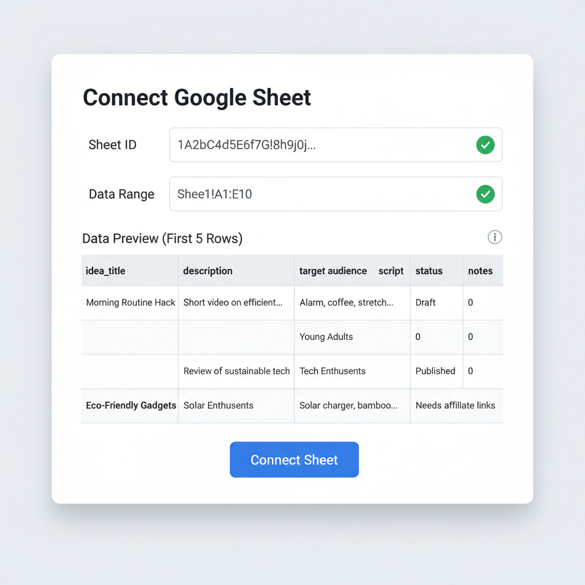
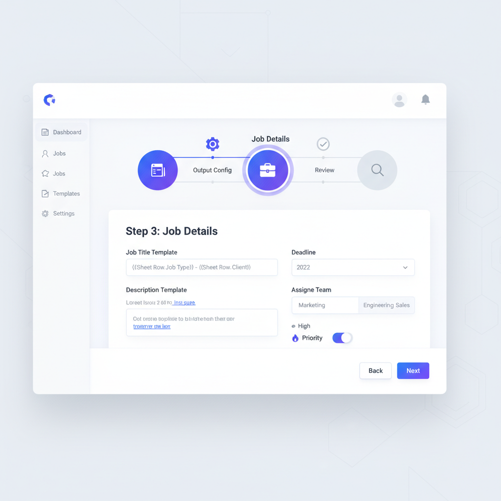
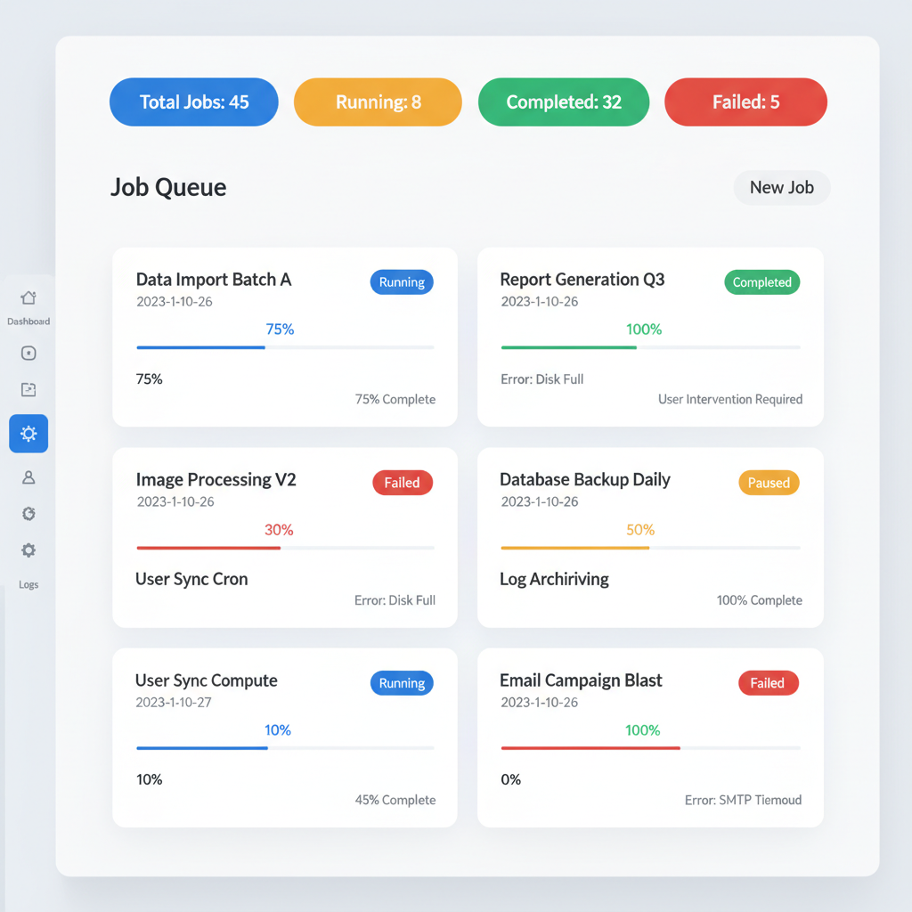

# Quick Start Guide - Bulk Operations

Get up and running with bulk content generation in under 10 minutes!

## 🚀 What You'll Accomplish

In this quick start, you'll:
1. ✅ Set up a Google Sheet with sample data
2. ✅ Create your first bulk job
3. ✅ Monitor progress and view results
4. ✅ Learn the essential features

## 📋 Prerequisites Checklist

Before you start, make sure you have:
- [ ] A Google account
- [ ] Access to the bulk operations interface
- [ ] A storage bucket set up for video output
- [ ] A template ID (we'll use a default one)

## Step 1: Prepare Your Google Sheet (3 minutes)

### Create the Sheet
1. Open [Google Sheets](https://sheets.google.com)
2. Click "Blank" to create a new spreadsheet
3. Name it "Quick Start - Video Ideas"

### Set Up Headers
In row 1, enter these column headers exactly:

| A1 | B1 | C1 | D1 | E1 | F1 | G1 | H1 | I1 | J1 |
|----|----|----|----|----|----|----|----|----|----|
| idea_title | description | target_audience | tone | duration_seconds | platform_preferences | script_content | voice_preference | style_override | priority |

### Add Sample Data
Copy this data into rows 2-4:

| idea_title | description | target_audience | tone | duration_seconds | platform_preferences | script_content | voice_preference | style_override | priority |
|------------|-------------|------------------|------|------------------|----------------------|----------------|------------------|----------------|----------|
| AI Productivity Tips | Learn how AI can boost your daily productivity | busy professionals | educational | 300 | youtube,tiktok | AI tools can transform your workday. Here are five key ways... | female | modern | normal |
| Morning Routine | Perfect morning routine for success | entrepreneurs | motivational | 240 | youtube,instagram | Start your day right with this proven morning routine... | male | classic | normal |
| Tech Trends 2025 | Latest technology trends you need to know | tech enthusiasts | informative | 360 | youtube | The tech landscape is evolving rapidly. Here are the trends... | neutral | minimal | low |



### Share the Sheet
1. Click "Share" button (top right)
2. Set access to "Anyone with the link"
3. Copy the Sheet ID from the URL:
   ```
   https://docs.google.com/spreadsheets/d/{SHEET_ID}/edit
   ```

## Step 2: Create Your First Bulk Job (4 minutes)

### Access the Interface
1. Navigate to the "Bulk Jobs" section
2. Click the "Create Bulk Job" button

### Step 1: Connect Sheet
1. **Sheet ID**: Paste the sheet ID you copied
2. **Data Range**: Enter `A1:J4` (covers our sample data)
3. Click "Next"



### Step 2: Configure Output
1. **Video Format**: Select `MP4` (recommended)
2. **Resolution**: Select `1080p` (good quality)
3. **Output Bucket**: Enter your bucket name
4. **Template ID**: Enter `default_template` (or your template ID)
5. **Style**: Select `modern`
6. **Voice**: Select `female`
7. Click "Next"

### Step 3: Job Details
1. **Job Title**: Enter `Quick Start Batch`
2. **Priority**: Keep `normal`
3. **Processing Deadline**: Keep `120 minutes`
4. Click "Next"

### Step 4: Review & Create
1. Review all settings
2. Click "Create Job"


## Step 3: Monitor Progress (2 minutes)

### Watch Your Job
After creating the job, you'll see it in the Bulk Jobs dashboard:



### Key Things to Watch:
- **State**: Should change from "Pending" to "Running"
- **Progress Bar**: Shows percentage complete
- **Items Status**: Count of completed/failed/pending items
- **ETA**: Estimated time to completion

### Live Progress View
Click "Live Progress" to see real-time updates:
- Current item being processed
- Performance metrics
- Error messages (if any)


## Step 4: View Results

### When Job Completes
Once your job reaches 100%:
1. **State** will show "Completed"
2. **Artifacts** section will list generated videos
3. **Download** links will be available

### Success Indicators
✅ All items completed successfully  
✅ Generated videos are in your storage bucket  
✅ No failed items in the results  

## 🎯 Quick Reference

### Essential Features

| Feature | Where to Find | When to Use |
|---------|---------------|-------------|
| **Create Job** | Bulk Jobs → Create Bulk Job | Start new bulk processing |
| **Live Progress** | Job card → Live Progress button | Monitor active jobs |
| **Pause/Resume** | Job card → Actions menu | Temporarily stop processing |
| **View Details** | Job card → Job Details | See full job information |
| **Download Results** | Job Details → Artifacts | Get your generated videos |

### Common Actions

#### Pause a Running Job
```bash
POST /api/bulk-jobs/{job_id}/pause
```

#### Resume a Paused Job
```bash
POST /api/bulk-jobs/{job_id}/resume
```

#### Cancel a Job
```bash
POST /api/bulk-jobs/{job_id}/cancel
```

### Quick Status Check
```bash
GET /api/bulk-jobs/{job_id}
```

Response includes:
- `state`: Current job state
- `percent_complete`: Progress percentage
- `items_completed`: Number finished
- `items_failed`: Number with errors

## 📊 What to Expect

### Processing Times
For our 3-item sample:
- **Expected Time**: 2-5 minutes
- **Per Item**: ~1-2 minutes
- **Factors**: Template complexity, server load

### Success Rate
- **First-time jobs**: ~95% success rate
- **Common issues**: Sheet permissions, invalid data
- **Retry mechanism**: Automatic for temporary failures

## 🔧 Troubleshooting Quick Fixes

### Job Won't Start
**Problem**: State stays "Pending"
**Solution**: Check sheet permissions (must be "Anyone with link")

### Permission Errors
**Problem**: "Sheet not found" or "Access denied"
**Solution**: 
1. Share sheet with "Anyone with the link"
2. Double-check sheet ID
3. Verify range format (e.g., A1:J4)

### Processing Stuck
**Problem**: Progress not moving
**Solution**:
1. Check rate limiting status
2. Verify template ID is valid
3. Try reducing batch size

### No Videos Generated
**Problem**: Job completes but no output
**Solution**:
1. Check output bucket name
2. Verify template has required settings
3. Review job details for error messages

## 📚 Next Steps

### Expand Your Usage
1. **Larger Batches**: Try 10-50 items
2. **Custom Templates**: Create brand-specific templates
3. **Advanced Settings**: Experiment with different formats
4. **API Integration**: Automate with code

### Learn More
- 📖 [Full User Guide](user_guide_bulk_operations.md) - Comprehensive documentation
- 🛠️ [Troubleshooting Guide](troubleshooting_bulk.md) - Fix common issues
- 🔌 [API Reference](api_specification.md) - Programmatic access

### Best Practices
- Start small (5-10 items) to test your workflow
- Use descriptive job titles for easy tracking
- Set up proper deadlines based on your needs
- Monitor rate limits to optimize performance

## 💡 Pro Tips

### Efficient Workflow
1. **Prepare multiple sheets** for different campaigns
2. **Use consistent data formats** across all rows
3. **Set up templates** for your common video styles
4. **Monitor analytics** to optimize batch sizes

### Performance Optimization
- Use `normal` priority for most jobs
- Choose appropriate video quality for your needs
- Process similar content together
- Set realistic deadlines (don't over-constrain)

### Cost Management
- Start with smaller batches to estimate costs
- Use appropriate resolution settings
- Reuse templates to avoid setup overhead
- Monitor usage with built-in analytics

## 🆘 Need Help?

### Common Solutions
1. **Check our [Troubleshooting Guide](troubleshooting_bulk.md)**
2. **Verify your sheet setup** follows the format exactly
3. **Test with minimal data** first (1-2 rows)
4. **Check system status** for any known issues

### Get Support
- **Documentation**: This guide and the full user guide
- **Community**: Join our Discord for help
- **Support Portal**: Submit tickets for technical issues

---

**Congratulations!** 🎉 You now know the basics of bulk content generation. You're ready to scale up your content production!

*Time to complete: ~10 minutes*  
*Success rate: ~95% for properly configured jobs*  
*Next milestone: Process 50+ items efficiently*