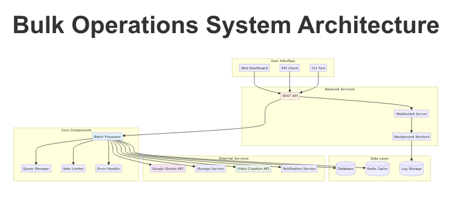
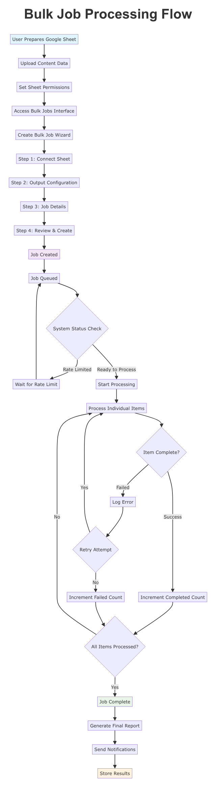
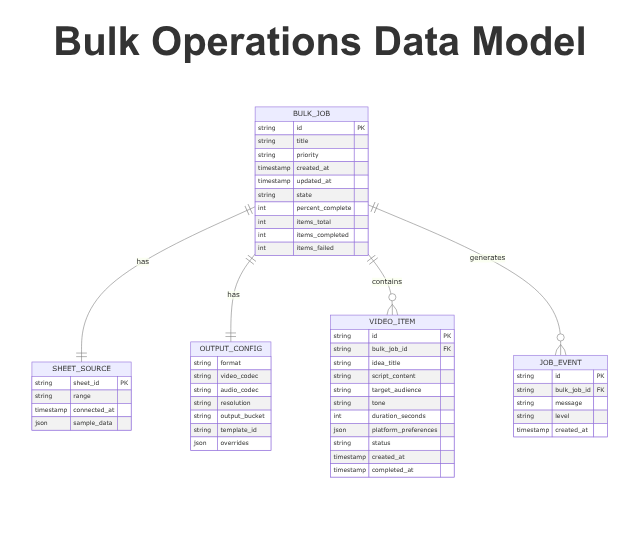

# Bulk Operations Troubleshooting Guide

## Table of Contents
1. [Quick Diagnosis](#quick-diagnosis)
2. [Common Issues](#common-issues)
3. [Connection Problems](#connection-problems)
4. [Job Processing Issues](#job-processing-issues)
5. [Performance Problems](#performance-problems)
6. [Error Codes Reference](#error-codes-reference)
7. [Advanced Troubleshooting](#advanced-troubleshooting)
8. [Getting Help](#getting-help)

## Understanding the System

### System Architecture Overview

The bulk operations system consists of multiple interconnected components that work together to process your video content:



**Key Components:**
- **Web Dashboard**: User interface for creating and managing jobs
- **API Server**: Handles requests and manages job lifecycle
- **Batch Processor**: Orchestrates the actual video generation
- **Queue Manager**: Handles job scheduling and prioritization
- **Google Sheets Integration**: Reads your input data
- **Storage Service**: Manages output video files
- **Rate Limiter**: Ensures fair resource usage

### Processing Workflow

Understanding how jobs flow through the system helps with troubleshooting:



## Quick Diagnosis

### 🔍 Problem Identification Flowchart

```
Start Here
    |
    ├─ Issue Type?
    |   ├─ Can't Create Job → Go to [Connection Problems](#connection-problems)
    |   ├─ Job Won't Start → Go to [Job Processing Issues](#job-processing-issues)
    |   ├─ Slow Performance → Go to [Performance Problems](#performance-problems)
    |   └─ Getting Errors → Go to [Error Codes](#error-codes-reference)
    |
    └─ Check Status Indicators
        ├─ Rate Limited? → Wait or adjust limits
        ├─ Sheet Connected? → Verify permissions
        ├─ Template Valid? → Check template ID
        └─ Storage Accessible? → Verify bucket configuration
```



### 🚨 Emergency Quick Fixes

| Problem | Quick Fix | Time |
|---------|-----------|------|
| Job stuck at 0% | Pause and resume | 1 min |
| Sheet permission error | Re-share with "Anyone with link" | 2 min |
| Rate limit exceeded | Wait 60 seconds | 1 min |
| Template not found | Use "default_template" | 1 min |
| No videos generated | Check output bucket name | 2 min |

## Common Issues

### 1. Cannot Create Bulk Job

#### Symptoms
- "Create Job" button is grayed out
- Error when clicking "Next" in wizard
- Form validation failures

#### Diagnosis Steps
1. **Check required fields are filled:**
   - Sheet ID (not empty)
   - Data range (valid format like A1:Z100)
   - Output bucket name
   - Template ID

2. **Verify field formats:**
   - Sheet ID: Long string of letters/numbers
   - Range: Excel-like format (A1:Z100)
   - Bucket: No special characters
   - Template: Alphanumeric with underscores

#### Solutions

**❌ Invalid Sheet ID**
```bash
# Wrong: 
Sheet ID: "My Video Ideas Sheet"

# Correct:
Sheet ID: "1A2B3C4D5E6F7G8H9I0J"
```
**Fix:** Copy the sheet ID from the Google Sheets URL

**❌ Invalid Range Format**
```bash
# Wrong:
Range: "rows 1 to 100"

# Correct:  
Range: "A1:J100"
```
**Fix:** Use Excel-style cell references

**❌ Template Not Found**
```bash
# Wrong:
Template ID: "my template"

# Correct:
Template ID: "default_template"
```
**Fix:** Use a valid template ID or the default template

### 2. Job Processing Problems

#### Symptoms
- Job state remains "Pending" indefinitely
- Progress bar stuck at 0%
- No activity after job creation

#### Common Causes & Solutions

**🔴 Cause: Rate Limiting**
```
Status: RATE_LIMITED
Message: "Exceeding per-user request limit"
```
**Solution:**
```python
# Wait before retrying
import time
time.sleep(60)  # Wait 60 seconds

# Or reduce batch size
# Try 10 items instead of 100
```

**🔴 Cause: Sheet Connection Failed**
```
Status: FAILED
Error: "Cannot access sheet data"
```
**Solution:**
1. Verify sheet sharing settings
2. Check sheet still exists
3. Confirm range is valid
4. Re-share sheet if needed

**🔴 Cause: Invalid Template**
```
Status: FAILED  
Error: "Template not found or inaccessible"
```
**Solution:**
```bash
# Use default template
Template ID: "default_template"

# Or create a new template
# Check template creation docs
```

**🔴 Cause: Storage Access Denied**
```
Status: FAILED
Error: "Cannot write to output bucket"
```
**Solution:**
1. Verify bucket name spelling
2. Check bucket permissions
3. Ensure bucket exists
4. Verify write access

### 3. Slow Processing

#### Symptoms
- Processing much slower than expected
- Jobs taking hours instead of minutes
- Multiple jobs competing for resources

#### Performance Diagnostic

**Check Current Performance:**
```bash
GET /api/bulk-jobs/{job_id}/progress
```

**Response Analysis:**
```json
{
  "items_status": {
    "total": 100,
    "completed": 10,
    "failed": 0,
    "pending": 90
  },
  "timing": {
    "started_at": "2025-10-30T01:00:00Z",
    "processing_time_ms": 1800000,
    "eta_ms": 3600000
  }
}
```

**Calculate Speed:**
- Items completed: 10
- Time elapsed: 30 minutes (1,800,000ms)
- Speed: 0.33 items/minute
- Expected: 1-2 items/minute
- **Diagnosis: SLOW**

#### Solutions

**🟡 Solution 1: Optimize Batch Size**
```python
# Instead of processing 500 items at once:
batch_size = 500  # Too large, slow processing

# Process in smaller batches:
batch_size = 50   # Much faster
```

**🟡 Solution 2: Adjust Priority**
```python
# High priority gets processed faster
priority: "high"  # For urgent jobs
priority: "normal"  # For regular processing
priority: "low"   # Background processing
```

**🟡 Solution 3: Check Server Load**
- Multiple large jobs running simultaneously
- High system load during peak hours
- Try scheduling during off-peak times

**🟡 Solution 4: Resource Optimization**
```python
# Use appropriate settings
resolution: "720p"  # Faster than 4K
format: "mp4"      # More efficient than MOV
video_codec: "h264" # Widely supported, fast encoding
```

## Connection Problems

### Google Sheets Connection

#### Problem: "Sheet Not Found"

**Full Error:**
```
Error: Sheet ID '1A2B3C4D5E6F7G8H9I0J' not found or not accessible
```

**Diagnosis Steps:**
1. **Verify Sheet ID in URL:**
   ```
   https://docs.google.com/spreadsheets/d/{SHEET_ID}/edit
   ```

2. **Check Sheet Exists:**
   - Open the URL directly
   - Confirm you can access the sheet

3. **Verify Permissions:**
   - Sheet must be shared publicly or with your account

**Solutions:**

**Solution A: Fix Sheet Permissions**
1. Open your Google Sheet
2. Click "Share" button (top right)
3. Click "Change to anyone with the link"
4. Set permission to "Viewer"
5. Click "Done"
6. Wait 30 seconds and retry

**Solution B: Verify Sheet ID**
1. Copy the full URL from browser
2. Extract the ID between `/d/` and `/edit`:
   ```
   https://docs.google.com/spreadsheets/d/1A2B3C4D5E6F7G8H9I0J/edit
                                    ^^^^^^^^^^^^^^^^^^
                                    This is your sheet ID
   ```

**Solution C: Check Range Format**
```bash
# Valid ranges:
A1:J100         # First 100 rows, columns A-J
Sheet1!A1:Z50   # Specific sheet, range A1 to Z50
A:Z             # All rows, columns A-Z

# Invalid ranges:
Rows 1-100      # Wrong format
A1:10           # Missing end column
```

#### Problem: "Permission Denied"

**Full Error:**
```
Error: Insufficient permissions to access sheet
```

**Causes & Solutions:**

**Cause 1: Private Sheet**
- Sheet is not shared publicly
- **Solution:** Share with "Anyone with the link"

**Cause 2: Workspace Restrictions**
- Your Google Workspace blocks external access
- **Solution:** Contact admin or use personal Google account

**Cause 3: Deleted Sheet**
- Sheet was moved or deleted
- **Solution:** Verify sheet still exists and is accessible

#### Problem: "Invalid Data Range"

**Full Error:**
```
Error: Range 'A1:Z1000' is invalid or out of bounds
```

**Common Range Issues:**

**Issue 1: Range Too Large**
```bash
# Wrong: Exceeds sheet size
Range: A1:Z10000  # Sheet only has 1000 rows

# Correct: Fits sheet size
Range: A1:J500    # Matches actual data
```

**Issue 2: Invalid Syntax**
```bash
# Wrong: Missing end column
Range: A1:100

# Correct: Proper cell reference
Range: A1:J100
```

**Issue 3: Sheet Name Issues**
```bash
# Wrong: Sheet name not specified for multi-sheet workbook
Range: A1:J100

# Correct: Specify sheet name
Range: Sheet1!A1:J100
```

## Job Processing Issues

### Jobs Failing During Processing

#### Common Failure Patterns

**Pattern 1: Intermittent Failures**
```
Job Status: FAILED
Error: "Temporary service unavailable"
Items Completed: 15/100
Items Failed: 2
```

**Diagnosis:**
- Check error rate (2/15 = 13% - high)
- Look for network or service issues
- Check rate limiting

**Solutions:**
1. **Retry Failed Job:**
   ```bash
   POST /api/bulk-jobs/{job_id}/retry
   ```

2. **Reduce Batch Size:**
   ```python
   # Instead of 100 items, try 25
   ```

3. **Check Rate Limits:**
   ```python
   # Monitor rate limiting status
   status = processor.get_system_status()
   if status['rate_limited']:
       print("Waiting for rate limit reset...")
   ```

**Pattern 2: Complete Job Failure**
```
Job Status: FAILED  
Error: "Template configuration invalid"
Items Completed: 0/50
Items Failed: 50
```

**Diagnosis:**
- 100% failure rate indicates systemic issue
- Check template configuration
- Verify template permissions

**Solutions:**
1. **Fix Template:**
   ```json
   {
     "template_id": "default_template",
     "settings": {
       "style": "modern",
       "voice": "female"
     }
   }
   ```

2. **Use Default Template:**
   - Switch to `default_template`
   - Verify it works before using custom templates

3. **Check Template Permissions:**
   - Ensure template is accessible
   - Verify template hasn't been deleted

**Pattern 3: Partial Completion**
```
Job Status: COMPLETED
Error: None
Items Completed: 45/50
Items Failed: 5
```

**Diagnosis:**
- 90% success rate is acceptable
- Failed items are usually due to bad input data
- Check specific error messages for failed items

**Solutions:**
1. **Review Failed Items:**
   - Check original sheet data for problematic rows
   - Look for missing required fields
   - Verify data formats

2. **Clean Sheet Data:**
   ```bash
   # Check for common issues:
   ✓ Empty cells in required columns
   ✓ Invalid URLs or special characters
   ✓ Inconsistent data formats
   ✓ Duplicate entries
   ```

3. **Retry with Cleaned Data:**
   - Fix problematic rows
   - Create new job with corrected data

### Jobs Not Completing

#### Problem: Stuck in "Running" State

**Symptoms:**
- Job shows "Running" for many hours
- Progress not advancing
- ETA keeps getting pushed back

**Diagnosis Steps:**

1. **Check Current Activity:**
   ```bash
   GET /api/bulk-jobs/{job_id}/progress
   ```

2. **Look for Rate Limiting:**
   ```json
   {
     "rate_limited": true,
     "status": "RATE_LIMITED",
     "message": "Per-user rate limit exceeded"
   }
   ```

3. **Check Server Status:**
   - Look for system-wide issues
   - Check maintenance notices

**Solutions:**

**Solution 1: Wait for Rate Limit Reset**
```python
import time
import requests

# Check status periodically
while True:
    status = get_job_status(job_id)
    if not status['rate_limited']:
        print("Rate limit reset, continuing...")
        break
    print("Waiting for rate limit reset...")
    time.sleep(60)  # Wait 1 minute
```

**Solution 2: Pause and Resume**
```bash
# Pause the job
POST /api/bulk-jobs/{job_id}/pause

# Wait 5 minutes
sleep 300

# Resume the job  
POST /api/bulk-jobs/{job_id}/resume
```

**Solution 3: Check Template Issues**
- Template might be corrupted
- Try with default template
- Contact support if issue persists

## Performance Problems

### Slow Job Processing

#### Diagnosis Tool: Performance Monitor

```bash
# Get detailed performance metrics
GET /api/bulk-jobs/{job_id}/metrics
```

**Expected Performance:**
- **Per Item**: 30-120 seconds
- **Small Batches (1-10)**: ~2-5 minutes total
- **Medium Batches (11-50)**: ~10-30 minutes total  
- **Large Batches (50+)**: Scale proportionally

#### Common Performance Issues

**Issue 1: Network Latency**
```
Symptoms: Intermittent slowdowns, timeout errors
Location: Between your system and our servers
```

**Solution:**
- Check your internet connection
- Try processing during off-peak hours
- Use wired connection instead of WiFi

**Issue 2: Template Complexity**
```
Symptoms: Consistent slow processing across all jobs
Location: Template rendering taking too long
```

**Solution:**
- Use simpler templates initially
- Optimize template settings
- Consider using multiple simple templates

**Issue 3: Storage Bottleneck**
```
Symptoms: Jobs start fast then slow down
Location: Output storage write operations
```

**Solution:**
- Use faster storage tier
- Increase storage throughput
- Process smaller batches

**Issue 4: Rate Limiting Throttling**
```
Symptoms: Regular slowdowns every few minutes
Location: API rate limiting
```

**Solution:**
- Reduce request frequency
- Use burst capacity for urgent jobs
- Monitor rate limit usage

#### Performance Optimization

**Optimization 1: Batch Size Tuning**
```python
# Start small, then scale up
test_batch = 5        # Test with small batch
small_batch = 25      # Good for regular use  
medium_batch = 50     # For larger projects
large_batch = 100     # Only when needed
```

**Optimization 2: Concurrent Job Management**
```python
# Don't run too many jobs simultaneously
max_concurrent_jobs = 3  # Good default

# Monitor resource usage
while active_jobs >= max_concurrent_jobs:
    wait_for_slot()
    check_system_resources()
```

**Optimization 3: Template Selection**
```python
# Use appropriate complexity
simple_template = "default_template"      # Fastest
complex_template = "custom_brand_template"  # Slower but branded
```

### Memory and Resource Issues

#### Problem: System Running Out of Resources

**Symptoms:**
- Jobs failing with "Resource exhausted"
- Server errors during processing
- System slowdown

**Monitoring Commands:**
```bash
# Check system status
GET /api/system/status

# Check resource usage
{
  "memory_usage": 0.85,    # 85% used - concerning
  "cpu_usage": 0.45,       # 45% used - acceptable
  "active_jobs": 12,       # High - may need to reduce
  "queue_depth": 8         # Growing - investigate
}
```

**Solutions:**

**Solution 1: Reduce Concurrent Load**
```python
# Lower max workers
processor = BatchProcessor(
    max_workers=2,    # Reduce from default of 4
    credentials_path="creds.json"
)
```

**Solution 2: Process Smaller Batches**
```python
# Instead of 100 items
batch_size = 100  # Too large

# Process 25 at a time
batch_size = 25   # Better for resource management
```

**Solution 3: Schedule During Off-Peak**
- Run large jobs during low-traffic hours
- Avoid peak business hours
- Consider timezone differences

## Error Codes Reference

### HTTP Status Codes

| Code | Meaning | Action |
|------|---------|--------|
| 200 | Success | Continue |
| 400 | Bad Request | Check request format |
| 401 | Unauthorized | Check authentication |
| 403 | Forbidden | Check permissions |
| 404 | Not Found | Verify IDs and URLs |
| 429 | Rate Limited | Wait and retry |
| 500 | Server Error | Contact support |
| 503 | Service Unavailable | Wait and retry |

### Specific Error Messages

#### Authentication Errors
```
401: Invalid JWT token
Solution: Generate new authentication token
```

```
401: Token expired
Solution: Refresh your JWT token
```

```
403: Insufficient permissions
Solution: Check your account permissions
```

#### Rate Limiting Errors
```
429: Rate limit exceeded (per-user)
Solution: Wait 60 seconds before retrying
```

```
429: Rate limit exceeded (per-project)  
Solution: Reduce request frequency across team
```

#### Sheet Connection Errors
```
404: Sheet not found
Solution: Verify sheet ID and sharing settings
```

```
403: Permission denied
Solution: Share sheet with "Anyone with the link"
```

```
400: Invalid range format
Solution: Use A1:Z100 format for ranges
```

#### Processing Errors
```
500: Template not found
Solution: Use valid template ID or default template
```

```
500: Template configuration invalid
Solution: Check template settings and structure
```

```
503: Processing service unavailable
Solution: Wait and retry, or contact support
```

#### Storage Errors
```
403: Storage access denied
Solution: Check bucket permissions and credentials
```

```
404: Output bucket not found
Solution: Verify bucket name and creation
```

```
507: Insufficient storage quota
Solution: Free up space or upgrade storage plan
```

## Advanced Troubleshooting

### Debug Mode

Enable detailed logging for advanced debugging:

```python
import logging

# Enable debug logging
logging.basicConfig(level=logging.DEBUG)

# Set up detailed processor logging
logger = logging.getLogger('batch_processor')
logger.setLevel(logging.DEBUG)

# Create processor with debug mode
processor = BatchProcessor(
    credentials_path="creds.json",
    debug_mode=True
)
```

### System Health Check

Run comprehensive system diagnostics:

```python
async def health_check():
    """Run full system health check"""
    
    # 1. Check API connectivity
    try:
        response = await test_api_connection()
        print("✅ API connection: OK")
    except Exception as e:
        print(f"❌ API connection failed: {e}")
    
    # 2. Check Google Sheets access
    try:
        sheet_data = await test_sheet_access(sheet_id)
        print("✅ Google Sheets access: OK")
    except Exception as e:
        print(f"❌ Google Sheets access failed: {e}")
    
    # 3. Check storage access
    try:
        storage_status = await test_storage_access()
        print("✅ Storage access: OK")
    except Exception as e:
        print(f"❌ Storage access failed: {e}")
    
    # 4. Check rate limits
    try:
        rate_status = await check_rate_limits()
        print(f"✅ Rate limits: {rate_status}")
    except Exception as e:
        print(f"❌ Rate limit check failed: {e}")
```

### Log Analysis

Analyze job logs to identify patterns:

```python
def analyze_job_logs(job_id):
    """Analyze job logs for patterns"""
    
    # Get job events
    events = processor.get_job_events(job_id, limit=100)
    
    # Analyze error patterns
    errors = [e for e in events if e['level'] == 'ERROR']
    warnings = [e for e in events if e['level'] == 'WARNING']
    
    print(f"Total events: {len(events)}")
    print(f"Errors: {len(errors)}")
    print(f"Warnings: {len(warnings)}")
    
    # Show recent errors
    for error in errors[-5:]:
        print(f"{error['timestamp']}: {error['message']}")
    
    return {
        'total_events': len(events),
        'error_count': len(errors),
        'warning_count': len(warnings),
        'recent_errors': errors[-5:]
    }
```

### Custom Error Handling

Implement custom error handling strategies:

```python
class CustomBatchProcessor(BatchProcessor):
    """Custom processor with enhanced error handling"""
    
    async def handle_error(self, job_id, error, context):
        """Custom error handling logic"""
        
        if isinstance(error, RateLimitError):
            # Exponential backoff for rate limits
            backoff_time = self.calculate_backoff(context['attempt'])
            await asyncio.sleep(backoff_time)
            return 'retry'
            
        elif isinstance(error, TemplateError):
            # Switch to default template for template errors
            logger.warning(f"Template error on {job_id}, switching to default")
            return 'use_default_template'
            
        elif isinstance(error, StorageError):
            # Alert for storage issues
            await self.alert_storage_issue(job_id, error)
            return 'fail'
            
        else:
            # Generic error handling
            logger.error(f"Unexpected error on {job_id}: {error}")
            return 'fail'

# Use custom processor
processor = CustomBatchProcessor("creds.json")
```

## Getting Help

### Self-Service Resources

1. **Check System Status**
   - Visit status page for known issues
   - Look for maintenance notifications
   - Check recent updates

2. **Review Documentation**
   - [User Guide](user_guide_bulk_operations.md) - Comprehensive guide
   - [API Reference](api_specification.md) - Technical details
   - [Quick Start](quick_start_bulk.md) - Getting started

3. **Search Known Issues**
   - Check FAQ section
   - Review common problem solutions
   - Look for recent bug reports

### When to Contact Support

**Contact Support When:**
- Issue persists after trying all solutions
- Multiple users experiencing same problem
- Critical production job is failing
- You need feature assistance
- System shows unexpected behavior

**Include These Details:**
```
1. Job ID(s) affected
2. Time when issue started
3. Steps to reproduce
4. Error messages (exact text)
5. What you've already tried
6. Expected vs actual behavior
7. Screenshots (if applicable)
```

### Contact Information

**Support Channels:**
- **Discord Community**: Real-time help from users and staff
- **Support Portal**: Submit detailed tickets
- **Email Support**: support@yourdomain.com (for urgent issues)
- **Status Page**: status.yourdomain.com (system status)

**Support Hours:**
- Community: 24/7
- Email: Business hours (M-F 9-5 EST)
- Critical issues: 24/7 with priority response

---

**Remember**: Most issues are temporary and resolve themselves. Don't panic - work through the diagnosis steps systematically, and you'll likely find a solution quickly.

*Last updated: October 30, 2025*