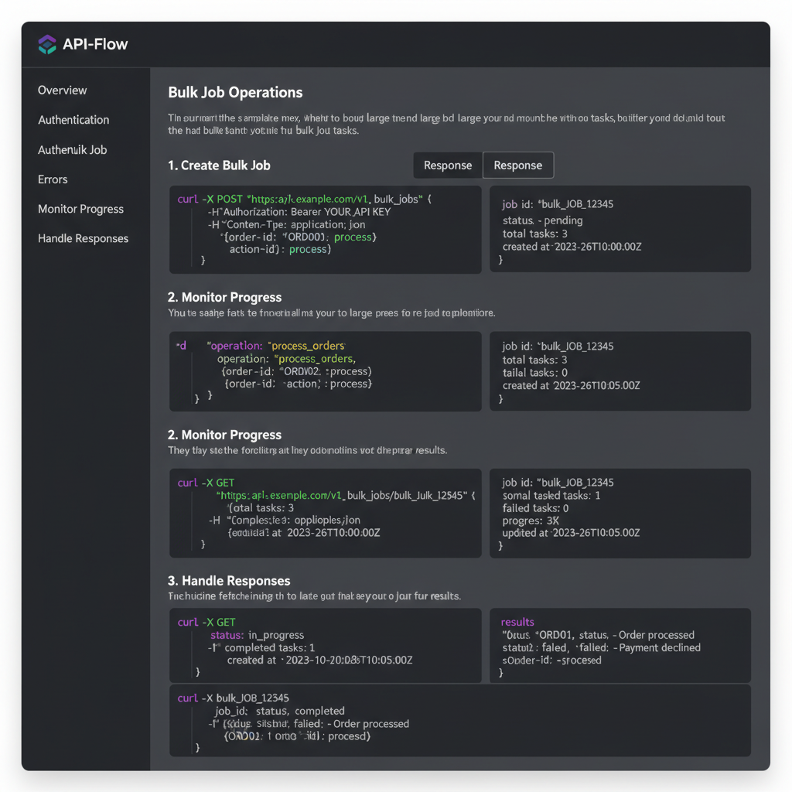

# Bulk Operations User Guide

## Table of Contents
1. [Overview](#overview)
2. [Getting Started](#getting-started)
3. [Creating Bulk Jobs](#creating-bulk-jobs)
4. [Managing Jobs](#managing-jobs)
5. [Monitoring Progress](#monitoring-progress)
6. [Google Sheets Integration](#google-sheets-integration)
7. [API Reference](#api-reference)
8. [Best Practices](#best-practices)
9. [Advanced Features](#advanced-features)

## Overview

The Bulk Operations system enables you to process multiple video ideas simultaneously by connecting to Google Sheets containing your content data. This powerful feature allows content creators, agencies, and businesses to scale their content production efficiently.

### Key Features
- **Batch Processing**: Generate hundreds of videos from a single Google Sheet
- **Progress Monitoring**: Real-time tracking of job progress and completion
- **Job Prioritization**: Set urgency levels (low, normal, high) for your jobs
- **Rate Limiting**: Intelligent throttling to respect API limits
- **Error Recovery**: Automatic retry with exponential backoff
- **Multi-format Output**: Support for various video formats and resolutions
- **Webhook Support**: Get notified when jobs complete


## Getting Started

### Prerequisites
1. **Google Account**: You need a Google account with access to Google Sheets
2. **API Access**: Your account must be authorized to use the content creation API
3. **Output Storage**: Set up a storage bucket (S3, GCS, or similar) for video output
4. **Template Access**: Have a valid template ID for video generation

### Accessing the System

#### Web Interface
1. Navigate to the Bulk Jobs section in your dashboard
2. Click "Create Bulk Job" to open the creation wizard
3. Follow the step-by-step process to configure your job

#### API Access
```bash
# Set up authentication
export API_TOKEN="your_jwt_token_here"
```

## Creating Bulk Jobs

The bulk job creation process consists of four main steps:

### Step 1: Connect Google Sheet

First, you need to connect to a Google Sheet containing your content data.

**Required Information:**
- **Sheet ID**: Found in the Google Sheets URL
  ```
  https://docs.google.com/spreadsheets/d/{SHEET_ID}/edit
  ```
- **Data Range**: The cell range containing your data (e.g., `A1:Z1000`)

**Sheet Format Requirements:**
Your Google Sheet should include these columns:

| Column | Description | Example |
|--------|-------------|---------|
| A | Idea/Title | "How to improve productivity" |
| B | Description | "Learn about AI tools" |
| C | Target Audience | "busy professionals" |
| D | Tone | "educational" |
| E | Duration (seconds) | "300" |
| F | Platform Preference | "youtube,tiktok" |
| G | Script Content | "Full script text..." |
| H | Voice Preference | "female" |
| I | Style | "modern" |
| J | Priority | "normal" |

**Sample Sheet Connection:**


### Step 2: Output Configuration

Configure how your videos will be generated and stored.

**Video Format Settings:**

| Setting | Options | Recommendation |
|---------|---------|----------------|
| **Format** | MP4, MOV, WebM | MP4 (most compatible) |
| **Video Codec** | H.264, H.265, VP9 | H.264 (best compatibility) |
| **Audio Codec** | AAC, Opus | AAC (most compatible) |
| **Resolution** | 720p, 1080p, 4K | 1080p (good quality/size balance) |

**Storage Configuration:**
- **Output Bucket**: Your storage bucket name
- **Template ID**: The template to use for video generation
- **Overrides**: 
  - **Style**: modern, classic, minimal, corporate
  - **Voice**: female, male, neutral

**Example Configuration:**

```json
{
  "format": "mp4",
  "video_codec": "h264",
  "audio_codec": "aac",
  "resolution": "1080p",
  "output_bucket": "my-videos-bucket",
  "template_id": "tpl_abc123",
  "overrides": {
    "style": "modern",
    "voice": "female"
  }
}
```


### Step 3: Job Details

Set the job-specific parameters.

**Job Configuration:**

| Parameter | Description | Options |
|-----------|-------------|---------|
| **Title** | Descriptive name for your job | Any string |
| **Priority** | Processing urgency | low, normal, high |
| **Processing Deadline** | Maximum time to complete | 1-1440 minutes |
| **Callback URL** | Webhook for completion notifications | Optional URL |

**Priority Guidelines:**
- **High**: Urgent campaigns, time-sensitive content
- **Normal**: Standard content production (default)
- **Low**: Background tasks, non-urgent content

### Step 4: Review and Create

Review all your settings before creating the job:

- Verify sheet connection and data range
- Confirm output format and storage settings
- Check job details and deadlines
- Review cost estimates (if available)

**Creating the Job:**


## Managing Jobs

### Job States

Jobs can be in one of several states throughout their lifecycle:

| State | Description | Actions Available |
|-------|-------------|-------------------|
| **Pending** | Waiting to start | Cancel |
| **Running** | Actively processing | Pause, Cancel |
| **Pausing** | Being paused | None |
| **Paused** | Temporarily stopped | Resume, Cancel |
| **Completing** | Finishing up | None |
| **Completed** | Successfully finished | View Results |
| **Canceling** | Being cancelled | None |
| **Canceled** | User cancelled | None |
| **Failed** | Error occurred | Retry, Cancel |

### Job Management Actions

#### Pause a Job
Use this when you need to temporarily stop processing:

```bash
curl -X POST "https://api.example.com/bulk-jobs/{job_id}/pause" \
  -H "Authorization: Bearer {token}"
```

#### Resume a Job
Continue processing a paused job:

```bash
curl -X POST "https://api.example.com/bulk-jobs/{job_id}/resume" \
  -H "Authorization: Bearer {token}"
```

#### Cancel a Job
Permanently stop a job:

```bash
curl -X POST "https://api.example.com/bulk-jobs/{job_id}/cancel" \
  -H "Authorization: Bearer {token}"
```

#### Retry a Failed Job
Start over with a failed job:

```bash
curl -X POST "https://api.example.com/bulk-jobs/{job_id}/retry" \
  -H "Authorization: Bearer {token}"
```

## Monitoring Progress

### Real-time Progress Tracking

The system provides multiple ways to monitor job progress:

#### 1. Dashboard Overview
View all your jobs at once with key metrics:


**Key Metrics:**
- **Total Jobs**: All jobs in your account
- **Running**: Currently active jobs
- **Completed**: Successfully finished jobs
- **Failed**: Jobs that encountered errors

#### 2. Individual Job Details

Click on any job card to see detailed information:


**Progress Information:**
- **Overall Progress**: Percentage complete
- **Items Status**: Completed/Failed/Pending counts
- **Time Tracking**: Start time, processing time, ETA
- **Rate Limiting**: Current status of rate limits

#### 3. Live Progress View

For active jobs, view real-time progress:


**Live Updates Include:**
- Current scene being processed
- Individual item status
- Error messages and warnings
- Performance metrics


### Progress Callbacks

Set up webhook notifications for automatic progress updates:

```javascript
// Example callback function
function onProgress(jobId, progress, message) {
  console.log(`Job ${jobId}: ${progress}% - ${message}`);
  
  // Update your UI
  updateProgressBar(jobId, progress);
  logMessage(message);
}

// Register callback
processor.addProgressCallback(onProgress);
```

## Google Sheets Integration

### Setting Up Your Sheet

#### 1. Create a New Sheet
1. Open Google Sheets
2. Create a new spreadsheet
3. Set up columns according to the format requirements

#### 2. Add Headers
```
A1: idea_title
B1: description  
C1: target_audience
D1: tone
E1: duration_seconds
F1: platform_preferences
G1: script_content
H1: voice_preference
I1: style_override
J1: priority
```

#### 3. Add Your Data
Populate rows 2 and beyond with your content data:



### Data Validation

The system validates your sheet data before processing:

**Required Fields:**
- `idea_title` (Column A): Must not be empty
- `script_content` (Column G): Must not be empty

**Optional Fields:**
- `description` (Column B): Recommended for context
- `target_audience` (Column C): Helps optimize content
- `duration_seconds` (Column E): Default is 300 seconds

**Validation Levels:**
- **Strict**: All fields required, data types checked
- **Moderate**: Required fields + basic validation (recommended)
- **Permissive**: Minimal validation, process what we can

### Sheet Connection Best Practices

1. **Permissions**: Ensure the sheet is shared with "Anyone with the link can view"
2. **Data Size**: Limit to 1000 rows for optimal performance
3. **Column Order**: Maintain the specified column order
4. **Data Types**: Use consistent data formats
5. **Backup**: Keep a backup of your sheet data

### Troubleshooting Sheet Issues

#### Common Connection Problems:

**Sheet Not Found**
```
Error: Sheet ID not found or not accessible
Solution: Verify the sheet ID and sharing permissions
```

**Invalid Range**
```
Error: Range A1:Z1000 is invalid
Solution: Check that the range exists and is properly formatted
```

**Permission Denied**
```
Error: Insufficient permissions to access sheet
Solution: Share the sheet with "Anyone with link can view"
```

## API Reference

### Authentication

All API requests require JWT authentication:

```bash
Authorization: Bearer {your_jwt_token}
Content-Type: application/json
```


### Core Endpoints

#### Create Bulk Job

```http
POST /api/bulk-jobs
```

**Request Body:**
```json
{
  "title": "Spring Campaign Videos",
  "priority": "normal",
  "processing_deadline_ms": 7200000,
  "callback_url": "https://yourapp.com/webhooks/job",
  "input_source": {
    "type": "sheet",
    "sheet_id": "1A2B3C4D5E6F7G8H9I0J",
    "range": "A1:Z1000"
  },
  "output": {
    "format": "mp4",
    "video_codec": "h264",
    "audio_codec": "aac",
    "resolution": "1080p",
    "output_bucket": "my-videos"
  },
  "template": {
    "template_id": "tpl_abc123",
    "overrides": {
      "style": "modern",
      "voice": "female"
    }
  }
}
```

**Response:**
```json
{
  "success": true,
  "data": {
    "id": "job_123",
    "state": "pending",
    "percent_complete": 0,
    "items_total": 150,
    "items_completed": 0,
    "items_failed": 0,
    "items_pending": 150,
    "created_at": "2025-10-30T01:00:00Z"
  }
}
```

#### List Bulk Jobs

```http
GET /api/bulk-jobs?page_size=20&sort=created_at&order=desc
```

**Query Parameters:**
- `page_size`: Number of jobs to return (max 100)
- `sort`: created_at, updated_at, percent_complete
- `order`: asc, desc
- `state`: Filter by job state
- `page_token`: For pagination

#### Get Job Status

```http
GET /api/bulk-jobs/{job_id}
```

#### Control Job Actions

```http
POST /api/bulk-jobs/{job_id}/pause
POST /api/bulk-jobs/{job_id}/resume
POST /api/bulk-jobs/{job_id}/cancel
POST /api/bulk-jobs/{job_id}/retry
```

#### Get Job Progress

```http
GET /api/bulk-jobs/{job_id}/progress
```

**Response:**
```json
{
  "success": true,
  "data": {
    "job_id": "job_123",
    "percent_complete": 45.5,
    "items_status": {
      "total": 150,
      "completed": 68,
      "failed": 2,
      "pending": 80,
      "skipped": 0
    },
    "timing": {
      "started_at": "2025-10-30T01:00:00Z",
      "processing_time_ms": 1800000,
      "eta_ms": 1200000
    },
    "rate_limited": false
  }
}
```

### JavaScript SDK Example

```javascript
import { BulkJobsClient } from '@your-org/content-creator-sdk';

const client = new BulkJobsClient({
  apiKey: 'your_api_key',
  baseURL: 'https://api.example.com'
});

// Create and monitor a bulk job
async function createAndMonitorJob() {
  try {
    // Create the job
    const job = await client.createJob({
      title: 'My Campaign Videos',
      sheet_id: '1A2B3C4D5E6F7G8H9I0J',
      range: 'A1:Z100',
      output_bucket: 'my-videos',
      template_id: 'tpl_abc123'
    });
    
    console.log('Job created:', job.id);
    
    // Monitor progress
    const progress = await client.monitorJob(job.id, (update) => {
      console.log(`Progress: ${update.percent_complete}%`);
    });
    
    console.log('Job completed:', progress);
    
  } catch (error) {
    console.error('Job failed:', error);
  }
}
```

### Python SDK Example

```python
from content_creator import BulkJobsClient

client = BulkJobsClient(
    api_key="your_api_key",
    base_url="https://api.example.com"
)

# Create bulk job
job = client.create_job(
    title="My Campaign Videos",
    sheet_id="1A2B3C4D5E6F7G8H9I0J",
    range="A1:Z100",
    output_bucket="my-videos",
    template_id="tpl_abc123"
)

# Monitor progress
for update in client.monitor_job(job['id']):
    print(f"Progress: {update['percent_complete']}%")
    if update['percent_complete'] == 100:
        print("Job completed!")
        break
```

## Best Practices

### 1. Sheet Preparation

**Data Quality:**
- Use consistent formatting across all cells
- Remove empty rows within your data range
- Validate URLs and email addresses if used
- Keep descriptions concise but informative

**Sheet Organization:**
- Use clear, descriptive headers
- Group related data together
- Use data validation to prevent errors
- Keep a backup copy before processing

### 2. Job Configuration

**Optimal Settings:**
- Use `normal` priority for most jobs
- Set deadlines based on actual needs (don't over-constrain)
- Choose formats based on your distribution platform
- Use templates that match your brand style

**Batch Size Guidelines:**
- **Small batches (1-50)**: Use for testing or urgent content
- **Medium batches (51-200)**: Good for regular content production
- **Large batches (200+)**: Plan for longer processing times

### 3. Monitoring and Management

**Regular Monitoring:**
- Check job progress daily for long-running jobs
- Set up alerts for failed jobs
- Monitor rate limiting to optimize batch sizes
- Review performance metrics to improve efficiency

**Resource Management:**
- Monitor your storage usage
- Clean up old job artifacts
- Track processing costs
- Optimize template usage

### 4. Error Handling

**Common Error Prevention:**
- Validate sheet data before creating jobs
- Use appropriate timeouts and deadlines
- Set up proper error notifications
- Have backup plans for critical content

**Recovery Strategies:**
- Use the retry mechanism for transient failures
- Split large jobs into smaller batches if needed
- Contact support for persistent issues
- Keep detailed logs for debugging

## Advanced Features

### Rate Limiting Management

The system implements intelligent rate limiting to ensure reliable processing:

**Per-User Limits:**
- 60 requests per minute per user
- Configurable based on your plan

**Per-Project Limits:**
- 300 requests per minute per project
- Shared across all users in a project

**Rate Limiter Usage:**

```python
from batch_processor import RateLimiter

# Custom rate limiter
rate_limiter = RateLimiter(
    per_user_limit=60,        # 60 requests per minute
    per_project_limit=300,    # 300 requests per minute
    refill_rate=5.0          # 5 tokens per second
)

processor = BatchProcessor(
    credentials_path="creds.json",
    rate_limiter=rate_limiter
)

# Check if request can proceed
if processor.rate_limiter.can_proceed(user_id="user123"):
    # Process request
    pass
else:
    # Wait or queue request
    backoff_time = processor.rate_limiter.get_backoff_time("user123")
    print(f"Rate limited, wait {backoff_time} seconds")
```

### Custom Templates

Create and use custom templates for your brand:

```json
{
  "template_id": "my_brand_template",
  "name": "My Brand Style",
  "description": "Custom template for brand videos",
  "settings": {
    "style": {
      "colors": ["#FF0000", "#00FF00", "#0000FF"],
      "font_family": "Arial",
      "logo_position": "bottom_right"
    },
    "audio": {
      "background_music": "brand_track.mp3",
      "voice_settings": {
        "speed": 1.0,
        "pitch": 0.0
      }
    }
  }
}
```

### Webhook Integration

Set up webhooks to receive real-time notifications:

```javascript
// Example webhook handler
app.post('/webhooks/bulk-job', (req, res) => {
  const { job_id, state, percent_complete, items_completed } = req.body;
  
  // Update your database
  updateJobStatus(job_id, state, percent_complete, items_completed);
  
  // Send notifications
  if (state === 'completed') {
    sendNotification('Job completed!', job_id);
  }
  
  res.status(200).send('OK');
});
```

### Cost Optimization

Optimize your costs with these strategies:

1. **Batch Size Optimization**
   - Find the sweet spot between efficiency and resource usage
   - Start with smaller batches to test performance

2. **Quality Settings**
   - Use appropriate resolution for your use case
   - Don't over-specify unless necessary

3. **Template Reuse**
   - Create and reuse templates to avoid setup overhead
   - Cache template configurations

4. **Scheduling**
   - Run large jobs during off-peak hours
   - Use lower priority for non-urgent content

### Analytics and Reporting

Track your usage and performance:

```javascript
// Get job analytics
const analytics = await client.getJobAnalytics({
  start_date: '2025-10-01',
  end_date: '2025-10-31',
  group_by: 'template_id'
});

console.log('Analytics:', analytics);
// Output:
// {
//   total_jobs: 25,
//   total_items: 1250,
//   success_rate: 0.96,
//   avg_processing_time: 45.2,
//   cost_summary: { total: 1250.00, by_template: {...} }
// }
```

## Troubleshooting

For detailed troubleshooting information, see [Troubleshooting Guide](troubleshooting_bulk.md).

## Support

If you need help with bulk operations:

1. **Documentation**: Check this guide and the API reference
2. **Troubleshooting Guide**: Common issues and solutions
3. **Support Portal**: Submit tickets for technical issues
4. **Community**: Join our Discord for discussions

---

*Last updated: October 30, 2025*
*Version: 2.0*